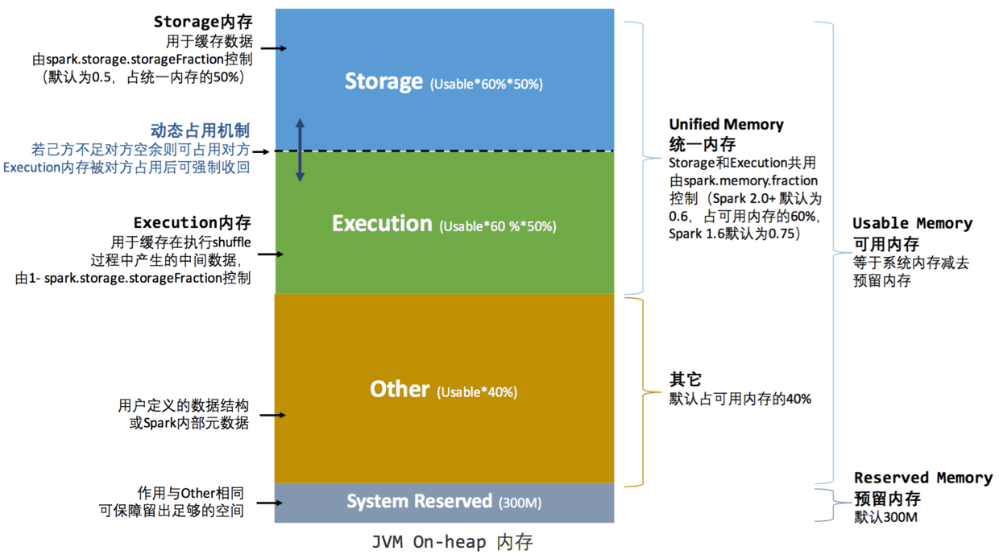
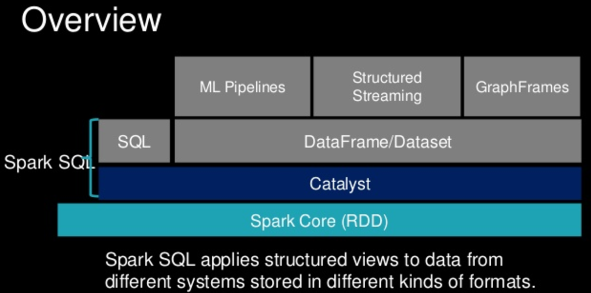
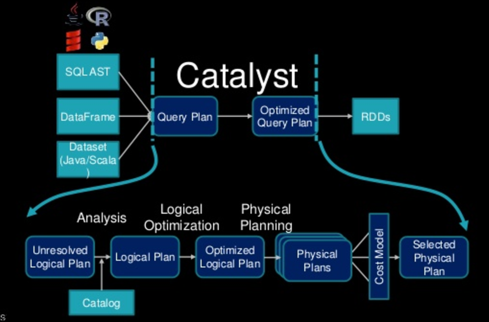

## 大数据技术栈

大数据技术栈：Zookeeper, Hdfs, Yarn, Spark, HBase, Hive, Presto, Elasticsearch, Kafka, Redis, Flume, Logstash，mapd,neo4j，mysql，mongodb，文件格式（Parquet, Carbondata, Lucene, Arrow）

大数据与分布式系统重要理论：CAP, MapReduce, MPP, Paxos, 2PC, 3PC，MVCC

架构知识：数据仓库，流式计算，多维查询，搜索，日志收集，OLAP，OLTP，分布式锁和主从选举, Lambda

设计模式：

数据结构与算法：排序、树、图基础算法，红黑树，BTree, skipList, HashMap, LinkedHashMap, 大数据算法

并发模型：actor, reactor, I/O多路复用（I/O Multiplexing）机制(select, epoll)

编程语言：Java, Scala, Python

纬度划分：计算，存储，网络

---

## 基础：计算

cgroups

## 基础：存储

Raid

## 基础：网络

SDN

VLAN: http://network.51cto.com/art/201409/450885_all.htm

## 编程语言

### Java

JVM进程、线程模型

线程同步和线程安全（重点ExecutorService, Future）, synchonized, volitoate

jdk常用数据结构的实现方式(重点ArrayList, LinkedList, HashMap, HashTable, LinkedHashMap,ConcurrentHashMap)

GC原理及调优(包括常用参数)

Java高并发程序的实现方法

反射和依赖注入

Java8 Stream 并行计算实现的原理
http://lvheyang.com/?p=87

如何实现无锁的链表(CAS)


### Python

Python并发模型，GIL

GC原理及调优

常用数据结构的实现方式

### Scala

Q1: class vs object vs trait vs case class?

## 数据结构与算法

排序算法

SkipList

树的数据结构与常用算法（重点红黑树、BTree）

图的数据结构与常用算法

HashMap, LinkedHashMap

大数据算法

详见[数据结构与算法笔记](./data-structure-algorithms.md)

## 设计模式

常用设计模式

如何用java，python实现常用设计模式

## 架构知识

数据仓库，流式计算，多维查询，搜索，日志收集，OLAP，OLTP，分布式锁和主从选举

## 大数据与分布式系统重要理论

CAP, MapReduce, MPP, Paxos, 2PC, 3PC，MVCC, WAL(Write ahead log)

## 大数据技术栈

> 待定：mapd,neo4j

> 数据库：mysql，mongodb

Q1: MySQL 不同引擎的区别？

Q2: MySQL, Mongodb 索引的原理？

A2: 详见[MySQL索引背后的数据结构及算法原理](http://blog.codinglabs.org/articles/theory-of-mysql-index.html)

```
B+树的实现细节是什么样的？B-树和B+树有什么区别？联合索引在B+树中如何存储？

索引原理，分不同的存储引擎：

(1) MyISAM的索引文件仅仅保存数据记录的地址。在MyISAM中，主索引和辅助索引（Secondary key）在结构上没有任何区别，只是主索引要求key是唯一的，而辅助索引的key可以重复

(2) InnoDB的数据文件本身就是索引文件,叶节点包含了完整的数据记录。这种索引叫做聚集索引。因为InnoDB的数据文件本身要按主键聚集，
所以InnoDB要求表必须有主键（MyISAM可以没有），如果没有显式指定，则MySQL系统会自动选择一个可以唯一标识数据记录的列作为主键，
如果不存在这种列，则MySQL自动为InnoDB表生成一个隐含字段作为主键，这个字段长度为6个字节，类型为长整形。
InnoDB的辅助索引data域存储相应记录主键的值而不是地址。换句话说，InnoDB的所有辅助索引都引用主键作为data域。
```

Q3: MySQL中，什么样的查询会用到索引？

Q4: 为什么Mysql用的是B+tree, Mongodb用的是B-tree, Lucene用的是SkipList ?

Q5: MySQL, Mongodb 如何实现HA ?

> 数据传输：Flume, Logstash

> 消息队列：Kafka

> 搜索，多维分析：Elasticsearch

> 数据仓库：Hive

> 文件格式：Parquet, Carbondata, Lucene, Arrow, mmdb

Q1: 画出完整的Parquet文件格式?

Q2: 画出完整的Lucene文件格式?

文件格式相关的笔记见[列式存储文件笔记](./bigdata_fileformat.md)

> 计算：Spark

spark 架构(Spark On Yarn):


[spark 架构详细解释](https://0x0fff.com/spark-architecture/)

备注：Application Master是Yarn上的概念，不是Spark里面的概念。

FAQ

Q1: RDD是什么？

A1: RDD是分布式的数据集。RDD划分成多个Partition分布到集群中，分区的多少涉及对这个RDD进行并行计算的粒度。RDD依赖关系，分两种：窄依赖(Narrow Dependencies)和宽依赖(Wide Dependencies)。
窄依赖是指每个父RDD都之多被一个RDD的分区使用，而宽依赖是多个子RDD的分区依赖一个父RDD的分区。例如map，filter操作是窄依赖，而join，groupbykey是宽依赖。

`TODO:` RDD的每个Partition 有副本？

Q2: 任务的调度？什么是DAG ? Spark DAG 的详细结构？

```
核心：DAGScheduler, TaskScheduler

DAGScheduler 负责划分Stage, 把不需要shuffle的transformations 合并到同一个Stage执行。

https://stackoverflow.com/a/30685279/1145750
```


 
Q3: 如何做容错（失败的任务和执行慢的任务）？

两种容错方式：Checkpoint , Lineage


```
RDD 的容错机制：

RDD的基本容错语义。
* 一个RDD是不可变的、确定可重复计算的、分布式数据集。每个RDD记住一个确定性操作的谱系(lineage)，这个谱系用在容错的输入数据集上来创建该RDD。
* 如果任何一个RDD的分区因为节点故障而丢失，这个分区可以通过操作谱系从源容错的数据集中重新计算得到。
* 假定所有的RDD transformations是确定的，那么最终转换的数据是一样的，不论Spark机器中发生何种错误。

RDDs track the graph of transformations that built them (their lineage) to rebuild lost data
	
通过判断DAG中lineage的长度和是否存在宽依赖，来确定RDD的分区丢失后重算的代价。
http://blog.csdn.net/jasonding1354/article/details/46882585
```

```
TODO: 根据lineage计算，那么最原始的数据源会一直保存在Spark内存中？（问题是计算RDD的数据源怎么来的？）

Spark does not replicate data in hdfs.

Spark arranges the operations in DAG graph.Spark builds RDD lineage. If a RDD is lost they can be rebuilt with the help of lineage graph. 
So there is no need of data replication as the RDDS can be recalculated from the lineage graph.

However if we persist RDDS with replicated storage levels(such as MEMORY_ONLY_2, MEMORY_AND_DISK_2) then the data may be replicated across nodes.

另外见我在stackoverflow comment中的疑问？
https://stackoverflow.com/questions/31624622/is-there-a-way-to-change-the-replication-factor-of-rdds-in-spark
```


    
    
```
(1) 计算与数据就近原则。在作业中如果某个任务执行缓慢，系统会在其他节点上执行该任务的副本，与MapReduce推测执行做法类似，取最先得到的结果作为最终的结果。
   
(2) TODO: 对于Spark Streaming, receiver接收数据后生成的RDD的每一个Partition，在内存中是多副本存储？
    
(3) Checkpoint 和 WAL 解决数据丢失。
https://www.slideshare.net/differentsachin/apache-spark-introduction-to-spark-streaming-and-deep-dive-57671774
```


Q4: Job/Stage/Task的并行执行关系？

一个Action生成一个Job，一次shuffle划分2个stage，task根据RDD Partition 一一对应生成。

Job中的Stage是通过DAGScheduler划分的，一次shuffle（宽依赖）划分2个stage，同一个Job中的不同Stage不能并行，同一个Stage中的不同Task可以并行。Task是执行的最小单元。

Q5: Spark vs MapReduce

A5: 并不是因为"内存计算"。而是内存迭代计算，任务依赖关系用DAG表示，支持map，reduce以外更丰富的算子。 

```
https://0x0fff.com/spark-misconceptions/

In general, Spark is faster than MapReduce because of:

1. Faster task startup time. Spark forks the thread, MR brings up a new JVM

2. Faster shuffles. Spark puts the data on HDDs only once during shuffles, MR do it 2 times

3. Faster workflows. Typical MR workflow is a series of MR jobs, each of which persists data to HDFS between iterations. 
Spark supports DAGs and pipelining, which allows it to execute complex workflows without intermediate data materialization (unless you need to “shuffle” it)

4. Caching. It is doubtful because at the moment HDFS can also utilize the cache, but in general Spark cache is quite good, 
especially its SparkSQL part that caches the data in optimized column-oriented form

All of these gives Spark good performance boost compared to Hadoop, which can really be up to 100x for short-running jobs, 
but for real production workloads it won’t exceed 2.5x – 3x at most.
```

Q6: Spark 如何做存储（内存/磁盘）管理？

A6: spark JVM 内存模型：



[spark1.6+ 内存模型详细解释1-part1](http://www.jianshu.com/p/3981b14df76b), [spark1.6+ 内存模型详细解释1-part2](http://www.jianshu.com/p/58288b862030)

[spark1.6+ 内存模型详细解释 2](https://0x0fff.com/spark-memory-management/)

* Execution Memory
    
    * storage for data needed during tasks execution
    
    * shuffle-related data
    
* Storage Memory
    
    * storage of cached RDDs and broadcast variables
    
    * possible to borrow from execution memory (spill otherwise)
    
    * safeguard value is 50% of Spark Memory when cached blocks are immune to eviction
    
* User Memory
    
    * user data structures and internal metadata in Spark
    
    * safeguarding against OOM

* Reserved memory
    
    * memory needed for running executor itself and not strictly related to Spark

Q7: Spark 调度策略？

Spark 的调度分为应用间调度：不同的Spark App之间的调度，调度的对象是spark app, 例如在Yarn上有FIFO, Fair两种；应用内调度的对象是Spark Job, 也分为FIFO, Fair两种。

对于应用内的Fair模式的调度，支持按照自定义的多个`pool`来区分调度，pool有3个重要的参数`schedulingMode`, `weight`, `minShare`, 
具体含义见[Spark Job Scheduling](http://spark.apache.org/docs/latest/job-scheduling.html#scheduling-within-an-application)

Spark应用内（同一个sparkContext），可以配置一个应用内的多个`TaskSetManager`间调度为FIFO还是FAIR。以Spark的Thrift Server为例，
考虑一个问题，用户a的作业很大，需要处理上T的数据，且SQL也非常复杂，而用户b的作业很简单，可能只是Select查看前面几条数据而已。
由于用户a、b都在同一个SparkContext里，所以其调度完全由Spark决定；如果按先入先出的原则，可能用户b要等好一会，
才能从用户a的牙缝里扣出一点计算资源完成自己的这个作业，这样对用户b就不是那么友好了。

比较好的做法是配置Spark应用内各个TaskSetManager的调度算法为`Fair`，不需要等待用户a的资源，用户b的作业可以尽快得到执行。
这里需要注意，FIFO并不是说用户b只能等待用户a所有Task执行完毕才能执行，而只是执行的很迟，并且不可预料。
从实测情况来看，配置为FIFO，用户b完成时间不一定，一般是4-6s左右；而配置为FAIR，用户b完成时间几乎是不变的，几百毫秒。

应用内调度的配置项在
```
{spark_base_dir}/conf/spark_default.conf：spark.scheduler.mode FAIR。
```

参考：http://spark.apache.org/docs/latest/job-scheduling.html#scheduling-within-an-application

参考：https://ieevee.com/tech/2016/07/11/spark-scheduler.html#

Q8: Shuffle 原理和优化？

[Spark Shuffle原理](https://0x0fff.com/spark-architecture-shuffle/)

During the shuffle `ShuffleMapTask` writes blocks to local drive, and then the task in the next stages `fetches these blocks` (compared to reduce in hadoop) over the network.

```
# shuffle 的策略：
before spark 1.2

hash shuffle:

after spark 1.2

sort shuffle:

* Incoming records accumulated and sorted in memory according their target partition ids

* Sorted records are written to file or multiple files if spilled and then merged

* Index file stores offsets of the data blocks in the data file

备注：Sort Shuffle 中的sort是指输出的文件内容，按照target rdd的partition id 排序，不是对数据进行排序。

```

Sort Shuffle 原理图如下：


参考：[Shuffle 原理1](http://datastrophic.io/core-concepts-architecture-and-internals-of-apache-spark/)

参考：[Shuffle 原理2](https://github.com/JerryLead/SparkInternals/blob/master/markdown/4-shuffleDetails.md)

Q9: Spark Join 优化?

A9: https://www.slideshare.net/databricks/optimizing-apache-spark-sql-joins

Q10: 如何存储和调度非常大（内存不够）的RDD？

```
TODO: LRU cache ? 当内存不够时，Spark如何决定RDD的哪个部分，最近最少使用？ 
```

Q11: Spark 消息通信原理？

A11: (1) Spark 运行时消息通信：用户提交应用程序时，应用程序的SparkContext会向Master发送应用注册消息，并由Master给该应用分配Executor,
Executor启动后，Executor会向SparkContext发送注册成功消息；当SparkContext的RDD触发action操作后，将创建RDD的DAG，通过DAGScheduler划分Stage,
并将Stage转化为TaskSet;接着由TaskScheduler向注册的Executor发送执行消息，Executor接收到任务消息后启动并运行；最后当所有任务运行完，
由Driver处理结果并回收资源。

Q12: Spark代码中，哪部分是在Driver端执行的？哪部分是在Executor端执行的？

Q13: RDD vs DataFrame vs DataSet ?

A13: 底层计算优化(catalyst)：结构化的数据计算，DataFrame/DataSet比RDD高很多。类型安全

Q14: Spark SQL 原理（执行流程，逻辑计划，物理计划，优化器）？



Catalyst优化：优化处理查询语句的整个过程，包括解析、绑定、优化、物理计划等，主要由关系代数（relation algebra）、表达式（expression）以及查询优化（query optimization）组成。



具体的原理，见databricks官方博客的详细描述 [Deep Dive into Spark SQL’s Catalyst Optimizer](https://databricks.com/blog/2015/04/13/deep-dive-into-spark-sqls-catalyst-optimizer.html)

```
Analysis: 解析表的基本信息(字段名、类型），解析UDF。

Logical Plan: 应用各个Rules,如constant folding, predicate pushdown, projection pruning, null propagation, Boolean expression simplification

Physical Plan: 生成多个物理可执行计划，选择其中成本最低的一个；还有join 的优化，见 https://www.slideshare.net/databricks/optimizing-apache-spark-sql-joins

Code Generation: 生成经过scala编译器优化的 Java bytecode

```

参考：[Spark SQL Internals](https://www.slideshare.net/databricks/a-deep-dive-into-spark-sqls-catalyst-optimizer-with-yin-huai)

参考：[Deep Dive into Spark SQL’s Catalyst Optimizer](https://databricks.com/blog/2015/04/13/deep-dive-into-spark-sqls-catalyst-optimizer.html)

Q15: Spark如何支持exactly-once的数据处理？

输入时记录offset, 输出时，确保是幂等或者支持事务。

幂等：输出多次，结果相同，比如生成文件覆盖上次生成的文件。

Q16: 影响 Spark App 性能／并发能力的重要因素有哪些，如何调优?

* Excutor Mem/Core size

* task并行程度

* cache常用的RDD

* 尽量避免shuffle

* GC / Kyro

* HDFS 读写性能(如果是HDFS input)

* 尽量用DataFrame 代替RDD (catalyst优化)

Spark References:

https://spark-summit.org/2014/wp-content/uploads/2014/07/A-Deeper-Understanding-of-Spark-Internals-Aaron-Davidson.pdf

> 计算：Presto

> NoSQL: HBase

> 资源管理调度：Yarn(资源隔离方法，调度策略，HA)

Yarn与HDFS的笔记整理见[HDFS, Yarn关键技术点](./hdfs-yarn.md)

> 存储：HDFS(namenode HA, fsimage)

Yarn与HDFS的笔记整理见[HDFS, Yarn关键技术点](./hdfs-yarn.md)

> 分布式一致性：Zookeeper，分布式锁和主从选举
