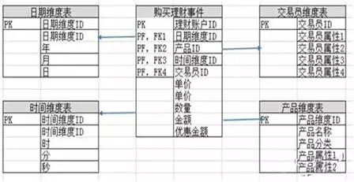

## 数据仓库理论

###  数据库理论

* ER关系

https://www.cnblogs.com/muchen/p/5265305.html

* 第一范式(1NF), 第二范式(2NF)，第三范式(3NF)

http://www.cnblogs.com/muchen/p/5272620.html

https://beginnersbook.com/2015/05/normalization-in-dbms/

https://www.guru99.com/database-normalization.html

```
# 结论： 

1NF: Only one value per column

2NF: All the non primary key columns in the table should depend on the entire primary key.

3NF: All the non primary key columns in the table should depend DIRECTLY on the entire primary key.

http://dotnetanalysis.blogspot.com/2012/01/database-normalization-sql-server.html
```


### 数据仓库理论

https://www.cnblogs.com/muchen/p/5305658.html

#### 数据建模

https://www.cnblogs.com/muchen/p/5310732.html

* Kimball(纬度模型) vs Inmon(关系模型)


关系建模又叫ER建模，是数据仓库之父Inmon推崇的，其从全企业的高度设计一个3NF模型的方法，用实体加关系描述的数据模型描述企业业务架构，在范式理论上符合3NF，其是站在企业角度进行面向主题的抽象，而不是针对某个具体业务流程的，它更多是面向数据的整合和一致性治理，正如Inmon所希望达到的“single version of the truth”。



维度模型则是数据仓库领域另一位大师Ralph Kimball 所倡导的。维度建模以分析决策的需求为出发点构建模型，一般有较好的大规模复杂查询的响应性能，更直接面向业务，典型的代表是我们比较熟知的星形模型，以及在一些特殊场景下适用的雪花模型。

Inmon的ER建模优点体现在规范性较好，冗余小，数据集成和数据一致性方面得到重视，适用于较为大型的企业级、战略级的规划，但缺点是需要全面了解企业业务、数据和关系，对于建模人员要求很高，实施周期非常长，成本昂贵，笔者刚进公司的时候就经历了中国移动的的ER数据仓库项目，的确不是一个新人能短时消化的。 

Kimball的维度建模相对能快速上手，快速交付，但缺点是冗余会较多，灵活性比较差，但其实现在看来也没什么，淘宝在大数据之路书中也提到“淘宝数据平台变迁的过程正好解释了二者的不同，最初，淘宝业务单一、系统简单，主要是简单的报表系统；后期数据量越来越大，系统越来越多，尝试用ER建模的数据仓库，但是在实践中发现快速变化的业务之下，构建ER模型的风险和难度都很高，现在则主要采用基于维度建模的模型方法了。”


```
微软的BI主要是基于Kimball模型的, 这个模型是反数据库三范式的, 提出了雪花模型和星型模型, 区分了事实表和维度表. Kimball还提出了一致性维度的概念. 把不同数据源的维度统一更新到一个维度上去. 就是SSAS

Inmon用的比较少, 他的数仓是符合范式(3NF)的设计, 然后用于分析的数据集市从这个normalized的数仓中派生数据, 好处是数仓是normalized的, 数据的准确性很高, 没有什么冗余的数据, 但是维护和开发工作量巨大.
常说的面向主题的数据仓库，就是Inmon的模型。

维度建模的方式: 星型模型和雪花模型

星型模型和雪花模型是区别于传统关系型数据库的三范式建模的一种建模方式, 星型模型运用广泛,效率高, 而雪花模型运用较少, 但往往会作配角存在. 为什么有了星型模型还要有雪花模型呢? 一个典型的例子就是为了支持多对多关系. 维度表和事实表见有多对多的关系. 此外当一个维度的数量级大到一定程度时, 如果用雪花模型能减少冗余数据的时候,也可以尝试使用雪花模型.

```

另，参考：https://zhuanlan.zhihu.com/p/27426819


* 纬度模型(Kimball)：

核心概念：纬度表，事实表

模型：星形模型 vs 雪花模型

http://lxw1234.com/archives/2018/01/890.htm

https://www.infoq.cn/article/2017/10/Dimensional-Kimball-big-data-Had

http://www.databaseanswers.org/downloads/Dimensional_Modelling_by_Example.pdf

Kimball模型数据仓库建模技巧：https://zhuanlan.zhihu.com/p/26908834


结论：

```
（1）雪花模型在星形模型的基础上，将纬度表拆的更细。

```

* ODS/DW/DM


---

参考：

https://www.vertabelo.com/blog/technical-articles/data-warehouse-modeling-star-schema-vs-snowflake-schema

https://www.computerweekly.com/tip/Inmon-or-Kimball-Which-approach-is-suitable-for-your-data-warehouse

https://blog.csdn.net/sinat_28472983/article/details/80948943
