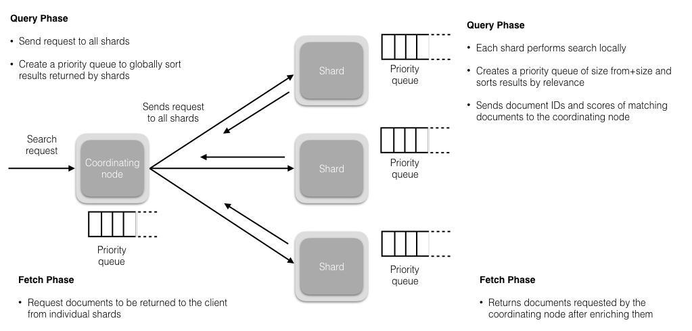

# Elasticsearch 关键技术点汇总

## 关键技术点

### 写入(索引)数据的详细流程

* 路由策略

```
shard_id = hash(routing_id) % num_of_shards
```

* refresh / flush / translog 机制, 异步sync / 生成segment

* segment merge

参考：https://blog.csdn.net/jiaojiao521765146514/article/details/83753215

* 写并发控制

* fsync

fsync 使用的是 `java.nio.channels.FileChannel.force()`

### 查询(搜索)的详细流程

* 路由策略

* 普通查询原理



参考：http://ginobefunny.com/post/elasticsearch_interview_questions/

* 聚合查询原理

### 节点管理

#### 1. 节点 Heap 内存都是如何被占用的

**Segment Memory**

Segment不是file吗？segment memory又是什么？前面提到过，一个segment是一个完备的lucene倒排索引，而倒排索引是通过词典(Term Dictionary)到文档列表(Postings List)的映射关系，快速做查询的。由于词典的size会很大，全部装载到heap里不现实，因此Lucene为词典做了一层前缀索引(Term Index)，这个索引在Lucene4.0以后采用的数据结构是FST (Finite State
Transducer)。这种数据结构占用空间很小，Lucene打开索引的时候将其全量装载到内存中，加快磁盘上词典查询速度的同时减少随机磁盘访问次数。

下面是词典索引和词典主存储之间的一个对应关系图:

说了这么多，要传达的一个意思就是，ES的data node存储数据并非只是耗费磁盘空间的，为了加速数据的访问，每个segment都有会一些索引数据驻留在heap里。因此segment越多，瓜分掉的heap也越多，并且这部分heap是无法被GC掉的！ 理解这点对于监控和管理集群容量很重要，当一个node的segment memory占用过多的时候，就需要考虑删除、归档数据，或者扩容了。

怎么知道segment memory占用情况呢? CAT API可以给出答案。

`查看一个索引所有segment的memory占用情况`
`查看一个node上所有segment占用的memory总和`

那么有哪些途径减少data node上的segment memory占用呢？总结起来有三种方法：

```
1. 删除不用的索引。

2. 关闭索引（文件仍然存在于磁盘，只是释放掉内存）。需要的时候可以重新打开。

3. 定期对不再更新的索引做optimize (ES2.0以后更改为force merge api)。这Optimze的实质是对segme
```

**Filter Cache**

Filter cache是用来缓存使用过的filter的结果集的，需要注意的是这个缓存也是常驻heap，无法GC的。默认的10% heap size设置工作得够好了，如果实际使用中heap没什么压力的情况下，才考虑加大这个设置。

** Field Data cache [ES 2.0 以后基本都是通过mmap加载的doc values，不再占用heap空间，占用的是文件系统缓存] **

对搜索结果做排序或者聚合操作，需要将倒排索引里的数据进行解析，然后进行一次倒排。在有大量排序、数据聚合的应用场景，可以说field data cache是性能和稳定性的杀手。这个过程非常耗费时间，因此ES
2.0以前的版本主要依赖这个cache缓存已经计算过的数据，提升性能。但是由于heap空间有限，当遇到用户对海量数据做计算的时候，就很容易导致heap吃紧，集群频繁GC，根本无法完成计算过程。`ES2.0以后，正式默认启用Doc Values特性(1.x需要手动更改mapping开启)，将field data在indexing time构建在磁盘上，经过一系列优化，可以达到比之前采用field data cache机制更好的性能。`因此需要限制对field data cache的使用，最好是完全不用，可以极大释放heap压力。这里需要注意的是，排序、聚合字段必须为not analyzed。设想如果有一个字段是analyzed过的，排序的实际对象其实是词典，在数据量很大情况下这种情况非常致命。

**Bulk Queue**

Bulk Queue是做什么用的？当所有的bulk thread都在忙，无法响应新的bulk request的时候，将request在内存里排列起来，然后慢慢清掉。一般来说，Bulk queue不会消耗很多的heap，但是见过一些用户为了提高bulk的速度，客户端设置了很大的并发量，并且将bulk Queue设置到不可思议的大，比如好几千。这在应对短暂的请求爆发的时候有用，但是如果集群本身索引速度一直跟不上，设置的好几千的queue都满了会是什么状况呢？ 取决于一个bulk的数据量大小，乘上queue的大小，heap很有可能就不够用，内存溢出了。一般来说官方默认的thread

pool设置已经能很好的工作了，建议不要随意去“调优”相关的设置，很多时候都是适得其反的效果。

**Indexing Buffer**

Indexing Buffer是用来缓存新数据，当其满了或者refresh/flush interval到了，就会以segment file的形式写入到磁盘。这个参数的默认值是10% heap size。根据经验，这个默认值也能够很好的工作，应对很大的索引吞吐量。但有些用户认为这个buffer越大吞吐量越高，因此见过有用户将其设置为40%的。到了极端的情况，写入速度很高的时候，40%都被占用，导致OOM。

**Cluster State Buffer**

ES被设计成每个Node都可以响应用户的api请求，因此每个Node的内存里都包含有一份集群状态的拷贝。这个Cluster state包含诸如集群有多少个Node，多少个index，每个index的mapping是什么？有少shard，每个shard的分配情况等等(ES有各类stats api获取这类数据)。在一个规模很大的集群，这个状态信息可能会非常大的，耗用的内存空间就不可忽视了。并且在ES2.0之前的版本，state的更新是由Master Node做完以后全量散播到其他结点的。频繁的状态更新都有可能给heap带来压力。在超大规模集群的情况下，可以考虑分集群并通过tribe node连接做到对用户api的透明，这样可以保证每个集群里的state信息不会膨胀得过大。

**超大搜索聚合结果集的fetch**

ES是分布式搜索引擎，搜索和聚合计算除了在各个data node并行计算以外，还需要将结果返回给汇总节点进行汇总和排序后再返回。无论是搜索，还是聚合，如果返回结果的size设置过大，都会给heap造成很大的压力，特别是数据汇聚节点。

来自：https://www.jianshu.com/p/f41b706db6c7

### 集群管理

* 角色划分：master node / data node / coord node

* master 选主

* cluster state

cluster state是全局性信息, 包含了整个群集中所有分片的元信息(规则, 位置, 大小等信息), 并保持每个每节的信息同步.

cluster state 是每个node上面都有吗？那如果发生了变更，如何同步呢？

在一个包含众多节点的集群中, ES是如何做到信息同步的呢? 原来ES的cluster state信息是由master节点维护的, 当它收到data节点的状态更新变化后, 就把这些信息依次广播到其他节点, 仅此而已.

* pending task

当集群出问题时，我们在cat health时会看到pending task，pending task到底是什么东西？

只有master节点能处理集群元数据层面的改变任务。大多数情况下，master可以处理，但当集群元数据改变的速度超过了master节点处理的速度时，将会导致这些元数据操作的任务被缓存入队列中，即pending tasks。pending task API 将会显示队列中被挂起的所有的集群`元数据改变的任务`。
当cluster state 太大的时候，一些改变很容易更新其cluster state，更新一次cluster state会消耗很多cpu还有传送到其他节点的网络带宽，会花费较多的时间。


* 跨集群查询

* 多租户

### Lucene 原理

* 倒排索引，相关性搜索：TF/IDF 原理

* 文件结构

* doc values / 文件系统缓存

### ES 调优经验

常见的调优策略：

https://mp.weixin.qq.com/s/Fvf9JcOc5oSRlLdHB4tYxA

---

## FAQ

1. Elasticsearch是如何实现Master选举的？

TODO: 用Paxos了吗？备选节点`node.master=true`为什么可以有偶数个？

2. 节点之间如何实现互相发现？

3. Master节点如何Failover, 如何防止brain split ?

4. Elasticsearch如何实现Document Update/Delete ?

```
删除和更新也都是写操作，但是Elasticsearch中的文档是不可变的，因此不能被删除或者改动以展示其变更；

delete，update是通过Lucene的.del文件实现的。

[delete]磁盘上的每个段都有一个相应的.del文件。当删除请求发送后，文档并没有真的被删除，而是在.del文件中被标记为删除。
该文档依然能匹配查询，但是会在结果中被过滤掉。当段合并时，在.del文件中被标记为删除的文档将不会被写入新段。

[update]在新的文档被创建时，Elasticsearch会为该文档指定一个版本号，当执行更新时，旧版本的文档在.del文件中被标记为删除，新版本的文档被索引到一个新段。
旧版本的文档依然能匹配查询，但是会在结果中被过滤掉。
```

5. 索引数据的详细流程 ?

6. 搜索的详细流程 ?

7. 性能调优？

8. 如何做聚合？聚合的结果是100%准确吗？

9. Lucene原理是什么？

10. 分布式相关问题：es的节点有哪些角色，都是什么功能；节点之间如何通信；如何做节点发现？

master, data, searcher, coord(client请求到的节点，动态不固定)

11. 分布式相关问题：分片创建策略，副本复制策略, 读写数据时的分片路由策略，副本容错策略，如何做到读写的计算请求尽可能负载均衡 ?

12. doc value原理及用法？
 
13. Index merge 原理？

14. Index recovery 原理？

15. 如何从ES获取大量数据？ES内部是如何实现的？

Scroll API的实现。

---

## References

http://ginobefunny.com/post/elasticsearch_interview_questions/

Lucene的索引文件格式(1): http://www.cnblogs.com/forfuture1978/archive/2009/12/14/1623597.html

Lucene的索引文件格式(2): http://www.cnblogs.com/forfuture1978/archive/2009/12/14/1623599.html

ES内存那点事 https://elasticsearch.cn/article/32

ES常见问题 https://www.jianshu.com/p/4e1154cbf86f
