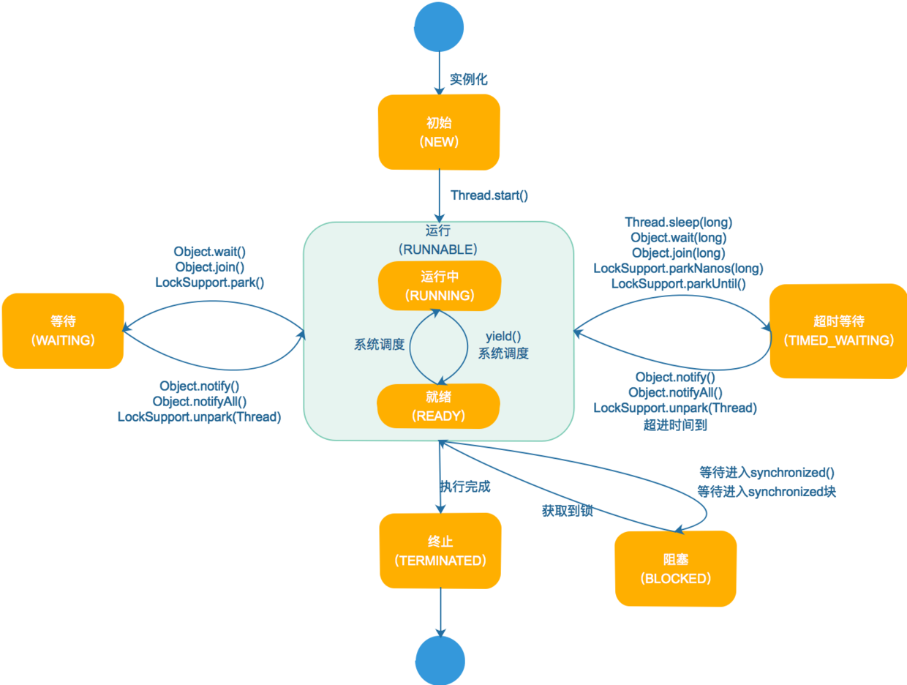

## Java

### collections 


### Java 并发编程

1. Java线程生命周期／状态切换



2. Thread, 完整分类图：

java.util.concurrent: 


由`ThreadPoolExecutor`衍生出来多个`ExecutorService`的实现。ThreadPoolExecutor源码分析参考：[ThreadPoolExecutor源码详解](https://my.oschina.net/xionghui/blog/494698)

3. BoundedThreadPool

4. 线程同步和线程安全

* synchonized

* volitoate

* transient

5. 线程通信

* BlockingQueue等Queue的实现

* Future获取线程执行结果

6. Java 如何实现无锁的链表(CAS)


### 常见设计模式在Java中的实现

1. 实现线程安全的单例模式


### JVM进程、线程模型、类的加载机制

### GC原理及调优(包括常用参数)

### jdk常用数据结构的实现方式和比较(重点ArrayList, LinkedList, HashMap, HashTable, LinkedHashMap,ConcurrentHashMap)

### 反射和依赖注入

### Java8 函数式编程与并行计算

http://lvheyang.com/?p=87


---

### FAQ

1. 如何判断一个对象是否存活?(或者GC对象的判定方法) ?

2. HashMap vs HashTable vs ConcurrentHashMap ?

```
# 先说一下HashMap的实现：
HashMap内部是通过一个数组实现的，只是这个数组比较特殊，数组里存储的元素是一个Entry实体(jdk 8为Node)，
这个Entry实体主要包含key、value以及一个指向自身的next指针。HashMap是基于hashing实现的，
当我们进行put操作时，根据传递的key值得到它的hashcode，然后再用这个hashcode与数组的长度进行模运算，
得到一个int值，就是Entry要存储在数组的位置（下标）；当通过get方法获取指定key的值时，
会根据这个key算出它的hash值（数组下标），根据这个hash值获取数组下标对应的Entry，
然后判断Entry里的key，hash值或者通过equals()比较是否与要查找的相同，如果相同，返回value，否则的话，
遍历该链表（有可能就只有一个Entry，此时直接返回null），直到找到为止，否则返回null。

HashMap之所以在每个数组元素存储的是一个链表，是为了解决hash冲突问题，当两个对象的hash值相等时，
那么一个位置肯定是放不下两个值的，于是hashmap采用链表来解决这种冲突，hash值相等的两个元素会形成一个链表。
```

```
jdk 1.6版: ConcurrenHashMap可以说是HashMap的升级版，ConcurrentHashMap是线程安全的，但是与Hashtablea相比，实现线程安全的方式不同。
Hashtable是通过对hash表结构进行锁定，是阻塞式的，当一个线程占有这个锁时，其他线程必须阻塞等待其释放锁。
ConcurrentHashMap是采用分离锁的方式，它并没有对整个hash表进行锁定，而是局部锁定，也就是说当一个线程占有这个局部锁时，不影响其他线程对hash表其他地方的访问。

具体实现:ConcurrentHashMap内部有一个Segment<K,V>数组,该Segment对象可以充当锁。Segment对象内部有一个HashEntry<K,V>数组，
于是每个Segment可以守护若干个桶(HashEntry),每个桶又有可能是一个HashEntry连接起来的链表，存储发生碰撞的元素。

每个ConcurrentHashMap在默认并发级下会创建包含16个Segment对象的数组，每个数组有若干个桶，当我们进行put方法时，通过hash方法对key进行计算，
得到hash值，找到对应的segment，然后对该segment进行加锁，然后调用segment的put方法进行存储操作，此时其他线程就不能访问当前的segment，
但可以访问其他的segment对象，不会发生阻塞等待。

jdk 1.8版 在jdk 8中，ConcurrentHashMap不再使用Segment分离锁，而是采用一种乐观锁CAS算法来实现同步问题，
但其底层还是“数组+链表->红黑树”的实现。

```

3. LinkedHashMap 为什么能做到按照元素插入顺序访问，而HashMap做不到 ?

```
LinkedHashMap也是基于HashMap实现的，不同的是它定义了一个Entry header，这个header不是放在Table里，它是额外独立出来的。
LinkedHashMap通过继承hashMap中的Entry,并添加两个属性Entry before,after,和header结合起来组成一个双向链表，
来实现按插入顺序或访问顺序排序。LinkedHashMap定义了排序模式accessOrder，该属性为boolean型变量，
对于访问顺序，为true；对于插入顺序，则为false。一般情况下，不必指定排序模式，其迭代顺序即为默认为插入顺序。

```

4. Java中有哪几种锁?

```

自旋锁: 自旋锁在JDK1.6之后就默认开启了。基于之前的观察，共享数据的锁定状态只会持续很短的时间，为了这一小段时间而去挂起和恢复线程有点浪费，所以这里就做了一个处理，让后面请求锁的那个线程在稍等一会，但是不放弃处理器的执行时间，看看持有锁的线程能否快速释放。为了让线程等待，所以需要让线程执行一个忙循环也就是自旋操作。

在jdk6之后，引入了自适应的自旋锁，也就是等待的时间不再固定了，而是由上一次在同一个锁上的自旋时间及锁的拥有者状态来决定

偏向锁: 在JDK1.之后引入的一项锁优化，目的是消除数据在无竞争情况下的同步原语。进一步提升程序的运行性能。 偏向锁就是偏心的偏，意思是这个锁会偏向第一个获得他的线程，如果接下来的执行过程中，改锁没有被其他线程获取，则持有偏向锁的线程将永远不需要再进行同步。偏向锁可以提高带有同步但无竞争的程序性能，也就是说他并不一定总是对程序运行有利，如果程序中大多数的锁都是被多个不同的线程访问，那偏向模式就是多余的，在具体问题具体分析的前提下，可以考虑是否使用偏向锁。

轻量级锁: 为了减少获得锁和释放锁所带来的性能消耗，引入了“偏向锁”和“轻量级锁”，所以在Java SE1.6里锁一共有四种状态，无锁状态，偏向锁状态，轻量级锁状态和重量级锁状态，它会随着竞争情况逐渐升级。锁可以升级但不能降级，意味着偏向锁升级成轻量级锁后不能降级成偏向锁。这种锁升级却不能降级的策略，目的是为了提高获得锁和释放锁的效率，下文会详细分析

```

5. volatile 关键词的作用？ 

volatile是一个特殊的修饰符，只有成员变量才能使用它。在Java并发程序缺少同步类的情况下，多线程对成员变量的操作对其它线程是透明的。
`volatile变量可以保证下一个读取操作会在前一个写操作之后发生`。

Q&A: CopyOnWriteArrayList, ConcurrentHashMap 不是强一致的？

synchronized, volatile, 

CAS: (CPU) AtomicBoolean, AtomicInteger..

mvcc,

如何实现无锁的链表。

Lock: wait, notify

JVM4种锁的级别。

nio 

---

### References
 
http://www.jianshu.com/p/04c0d796d877

http://www.blogjava.net/xylz/archive/2010/06/30/324915.html

Java 并发编程总结 http://ginobefunny.com/post/java_concurrent_interview_questions/

[Java Concurrency In Practice](./java_slides/Java_Concurrency_In_Practice.pdf)

《Java8 函数式编程》