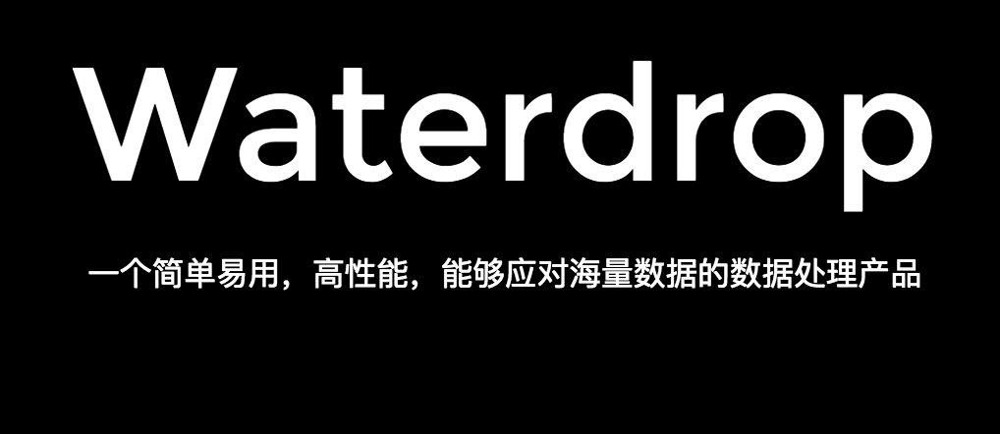
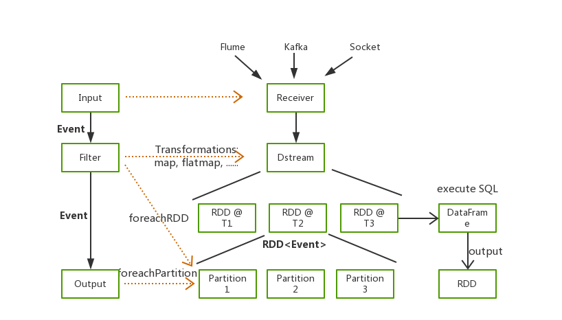

# Waterdrop帮你快速玩转Spark数据处理

> 屠龙宝刀，宝刀屠龙，踏遍天下，谁敢不从，倚天不出，谁与争锋！




Databricks 开源的 Apache Spark 对于分布式数据处理来说是一个伟大的进步。我们在使用 Spark 时发现了很多可圈可点之处，我们在此与大家分享一下我们在简化Spark使用和编程以及加快Spark在生产环境落地上做的一些努力。

## 一个Spark Streaming读取Kafka的案例

以一个线上案例为例，介绍如何使用Spark Streaming统计Nginx后端日志中每个域名下每个状态码每分钟出现的次数，并将结果数据输出到外部数据源Elasticsearch中。其中原始数据已经通过Rsyslog传输到了Kafka中。

### 数据读取

从Kafka中每隔一段时间读取数据，生成DStream
```Scala
val directKafkaStream = KafkaUtils.createDirectStream[
     [key class], [value class], [key decoder class], [value decoder class] ](
     streamingContext, [map of Kafka parameters], [set of topics to consume])
```

具体方法参考[Spark Streaming + Kafka Integration Guide](http://spark.apache.org/docs/latest/streaming-kafka-0-8-integration.html)

### 数据清洗

日志案例

    192.168.0.1 interestinglab.github.io 127.0.0.1 0.001s [22/Feb/2018:22:12:15 +0800] "GET /waterdrop HTTP/1.1" 200 8938 "http://github.com/" - "Mozilla/5.0 (Windows NT 6.1; WOW64) AppleWebKit/537.36 (KHTML, like Gecko) Chrome/55.0.2883.87 Safari/537.36"

通过`Split`方法从非结构化的原始数据`message`中获取域名以及状态码字段，并组成方便聚合的结构化数据格式*Map(key -> value)*

```Scala
val splitList = message.split(" ")
val domain = splitList(1)
val httpCode = splitList(9)
val item = Map((domain, httpCode) -> 1L)
```

### 数据聚合

利用Spark提供的`reduceByKey`方法对数据进行聚合计算，统计每分钟每个域名下的每个错误码出现的次数，其中`mapRdd`是在清洗数据阶段组成的RDD

```Scala
val reduceRdd = mapRdd.reduceByKey((a:Long, b:Long) => (a + b))
```

### 数据输出

利用Spark提供的`foreachRDD`方法将结果数据`reduceRdd`输出到外部数据源Elasticsearch
```Scala
reduceRdd.foreachRDD(rdd => {
    rdd.saveToEs("es_index" + "/es_type", esCfg)
})
```

### 总结

我们的确可以利用Spark提供的API对数据进行任意处理，但是整套逻辑的开发是个不小的工程，需要一定的Spark基础以及使用经验才能开发出稳定高效的Spark代码。除此之外，项目的编译、打包、部署以及测试都比较繁琐，会带来不少得时间成本和学习成本。

除了开发方面的问题，数据处理时可能还会遇到以下不可逃避的麻烦：

- 数据丢失与重复

- 任务堆积与延迟

- 吞吐量低

- 应用到生产环境周期长

- 缺少应用运行状态监控

因此我们开始尝试更加简单高效的Spark方案，并试着解决以上问题

## 一种简单高效的方式 -- Waterdrop

Waterdrop 是一个`非常易用`，`高性能`，能够应对`海量数据`的`实时`数据处理产品，构建于Apache Spark之上。

Waterdrop 项目地址：https://interestinglab.github.io/waterdrop

Spark固然是一个优秀的分布式数据处理工具，但是正如上文所表达的，Spark在我们的日常使用中还是存在不小的问题。因此我们也发现了我们的机会 —— 通过我们的努力让Spark的使用更简单，更高效，并将业界和我们使用Spark的优质经验固化到Waterdrop这个产品中，明显减少学习成本，加快分布式数据处理能力在生产环境落地

"Waterdrop" 的中文是“水滴”，来自中国当代科幻小说作家刘慈欣的《三体》系列，它是三体人制造的宇宙探测器，会反射几乎全部的电磁波，
表面绝对光滑，温度处于绝对零度，全部由被强互作用力紧密锁死的质子与中子构成，无坚不摧。
在末日之战中，仅一个水滴就摧毁了人类太空武装力量近2千艘战舰。


## Waterdrop 的特性

* 简单易用，灵活配置，无需开发；可运行在单机、Spark Standalone集群、Yarn集群、Mesos集群之上。

* 实时流式处理, 高性能, 海量数据处理能力

* 模块化和插件化，易于扩展。Waterdrop的用户可根据实际的需要来扩展需要的插件，支持Java/Scala实现的Input、Filter、Output插件。
如果您对插件扩展感兴趣，可移步至[Waterdrop插件开发](https://interestinglab.github.io/waterdrop/#/zh-cn/developing-plugin)

* 支持利用SQL做数据处理和聚合


## Waterdrop 的原理和工作流程



Waterdrop 利用了Spark的Streaming, SQL, DataFrame等技术，Java的反射机制、Service Loader等技术以及Antlr4的语法解析技术，
实现了一套完整的可插拔的数据处理工作流，如下：


多个Filter构建了数据处理的Pipeline，满足各种各样的数据处理需求，如果您熟悉SQL，也可以直接通过SQL构建数据处理的Pipeline，简单高效。
目前Waterdrop支持的Filter列表(数据处理插件), 仍然在不断扩充中。
您也可以开发自己的数据处理插件，整个系统是易于扩展的。通过下面的配置示例，你可以快速了解到这种工作流程：

```
spark {
  # Waterdrop defined streaming batch duration in seconds
  spark.streaming.batchDuration = 5

  spark.app.name = "Waterdrop"
  spark.ui.port = 13000
}

input {
  socket {}
}

filter {
  split {
    fields = ["msg", "name"]
    delimiter = ","
  }
}

output {
  stdout {}
}
```

* `spark`是spark相关的配置，

可配置的spark参数见：
[Spark Configuration](https://spark.apache.org/docs/latest/configuration.html#available-properties),
其中master, deploy-mode两个参数不能在这里配置，需要在Waterdrop启动脚本中指定。

* `input`可配置任意的input插件及其参数，具体参数随不同的input插件而变化。input支持包括`File`, `Hdfs`, `Kafka`, `S3`, `Socket`等插件。

* `filter`可配置任意的filter插件及其参数，具体参数随不同的filter插件而变化。filter支持包括`Date`, `Json`, `Split`, `Sql`, `Table`, `Repartition`等40+个插件。

filter中的多个插件按配置顺序形成了数据处理的pipeline, 上一个filter的输出是下一个filter的输入。

* `output`可配置任意的output插件及其参数，具体参数随不同的output插件而变化。

`filter`处理完的数据，会发送给`output`中配置的每个插件。output支持包括`Elasticsearch`, `File`, `Hdfs`, `Jdbc`, `Kafka`, `Mysql`, `S3`等插件。


## 如何使用 Waterdrop

Step 1 : 使用 Waterdrop前请先准备好Spark和Java运行环境。

Step 2 : 下载[Waterdrop安装包](https://github.com/InterestingLab/waterdrop/releases) 并解压:

```
# 以waterdrop 1.0.2为例:
wget https://github.com/InterestingLab/waterdrop/releases/download/v1.0.2/waterdrop-1.0.2.zip -O waterdrop-1.0.2.zip
unzip waterdrop-1.0.2.zip
ln -s waterdrop-1.0.2 waterdrop
cd waterdrop
```

Step 3 : 配置 Waterdrop(从kafka消费数据，做字符串分割，输出到终端), 编辑 `config/application.conf`

```
spark {
  # Waterdrop defined streaming batch duration in seconds
  spark.streaming.batchDuration = 5

  spark.app.name = "Waterdrop"
  spark.ui.port = 13000
  spark.executor.instances = 2
  spark.executor.cores = 1
  spark.executor.memory = "1g"
}

input {
  kafka {
    topics = "mytopic"
    consumer.bootstrap.servers = "localhost:9092"
    consumer.zookeeper.connect = "localhost:2181"
    consumer.group.id = "waterdrop_group"
  }
}

filter {
  split {
    fields = ["msg", "name"]
    delimiter = ","
  }
}

output {
  stdout {}
}
```

Step 4 : 启动 Waterdrop

```
./bin/start-waterdrop.sh --master yarn --deploy-mode client --config ./config/application.conf
```

更详细的使用方法见[Waterdrop Quick Start](https://interestinglab.github.io/waterdrop/#/zh-cn/quick-start)


## Waterdrop 未来发展路线

Waterdrop 会分为3条路线，详细展开：

（1）提供更多Input, Filter, Output插件，提高易用性、可靠性、数据一致性。

（2）支持Apache Flink / Apache Beam，支持Spark以外的分布式数据计算模型。

（3）支持流式机器学习，能够通过简单的Pipeline和配置，完成常用流式机器学习模型的训练。


Waterdrop 项目地址：https://interestinglab.github.io/waterdrop

---

Waterdrop 项目由**Interesting Lab**开源。Interesting Lab （https://github.com/InterestingLab）, 中文译名有趣实验室。成立于2016年，致力于让大数据变得更简单有价值。
